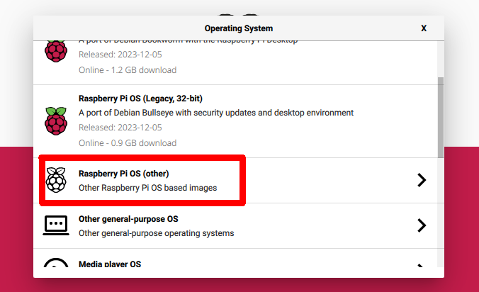
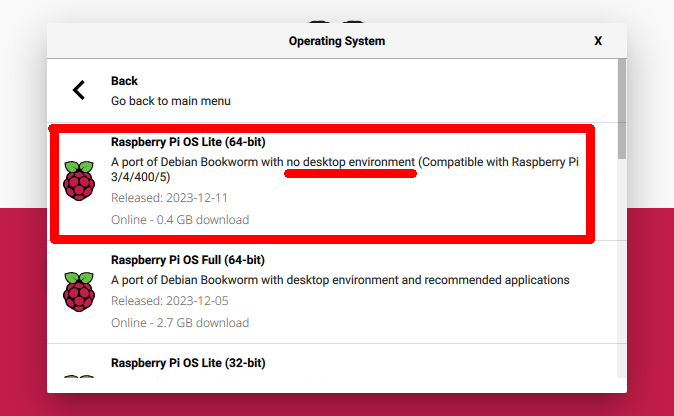
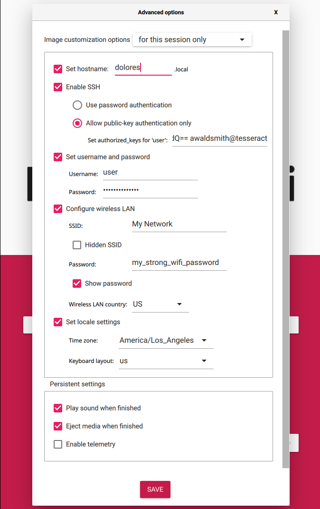

# Prius Camping

This repository contains the source code and documentation regarding my 2014 Prius camping setup. Diagnostics and vehicle sensor data provided by the ECU over a USB OBD2 serial cable (`ISO 9141`) to a Raspberry Pi dashboard.

I also provide helpful tips and recommended items in my [Prius Camping & Survival Overview](./docs/README.md).

Please join our 𝕏 [Prius Camping Community](https://x.com/i/communities/1760105186679570893)!

## Components
- This repo covers the following:
  - Captive Portal Pages
  - pfSense Configuration
  - RaspberryPi FS Overlays and Configurations
- [prius-camping-api](https://github.com/anthonywww/prius-camping-api) - Main API Service
- [prius-camping-gateway](https://github.com/anthonywww/prius-camping-gateway) - Live Events WebSocket Server Gateway
- [prius-camping-dash](https://github.com/anthonywww/prius-camping-dash) - Web Dashboard
- [prius-camping-site](https://github.com/anthonywww/prius-camping-site) - LAN Site & Post Captive Portal Landing Page

## Features

For a list of hardware used in this project [click here](./docs/prius_camping.md#hardware).

- [x] Raspberry Pi 4 (model B) Raspbian (Debian) Linux Computer.
- [x] 10.1" LCD DSI Touch Display.
- [x] 2kW 120v AC Inverter.
- [ ] Starlink:
  - [X] Total bypass of Starlink Router.
  - [ ] Starlink gRPC endpoint statistics.
  - [ ] Starlink IPv4 GCNAT + IPv6 port forward.
- [ ] Internal Web Server for UI Dashboard (Firefox in Kiosk mode):
  - [ ] Onscreen JS keyboard.
- [ ] Exposable API server (provides OBD-II data).
- [ ] Exposable Web Server UI for car's website.


## Result

**TBA:** These are some images of the project. Screenshots and pictures of the wiring.


## Install

### 1. Setup

It is expected that you have a fresh clean install of the latest version of Rasbian Lite before continuing.

It is also expected you have a secure SSH key generated to access your RPi.

```sh
# Generate a new SSH key (Dolores is my car's name)
ssh-keygen -t rsa -b 4096 -P "" -f ~/.ssh/dolores

# View the public key to add in a later step
cat ~/.ssh/dolores.pub

# Add the newly generated SSH key to your keyring
ssh-add ~/.ssh/dolores
```

#### Using Raspberry Pi Imager

I recommend using the Raspberry Pi Imager for burning a fresh Rasbian install on a micro-SD card.






Select the gear in the bottom right corner to open the "Advanced options" menu.

Ensure the following settings are set with your desired username, a strong user password, and network settings if you are using WiFi.




### 2. Configuration

Copy the `example-config.sh` file to `config.sh` and configure it accordingly.


### 3. Run Installer

Now run `./deploy.sh install <host>` to install the project on to the host.


## Development


### UI Layout


- [ ] GENERAL
  - [ ] Dashboard
  - [ ] 3D View
  - [ ] HVAC
  - [ ] Map
  - [ ] System Logs
- [ ] NETWORK
  - [ ] Status
    - [ ] Starlink
    - [ ] WiFi
    - [ ] Upstream
    - [ ] Downstream
    - [ ] WiFi Enabled
    - [ ] DNS Status
    - [ ] DHCP Status
    - [ ] Captive Portal
    - [ ] DNS Overrides
  - [ ] Web Browser (sandboxed iframe?)
- [ ] SENSORS
  - [ ] Status
    - [ ] Thermal Sensors
    - [ ] Pressure Sensors
    - [ ] Accelerometer Sensors
    - [ ] Ultrasonic Sensors
    - [ ] Outside Temperature
    - [ ] Inside Temperature


### Database Configuration


## Special Thanks
- My friends: Kyle, Harsh, Wade, Ashley, Khushi, Marcus
- Nikki Delventhal
- Levi & Leah
- Black Jimmy Neutron
- Joe Robinet
- J's Camp
- [OpenStreetMap](https://www.openstreetmap.org/)
- [Leaflet](https://leafletjs.com/)
