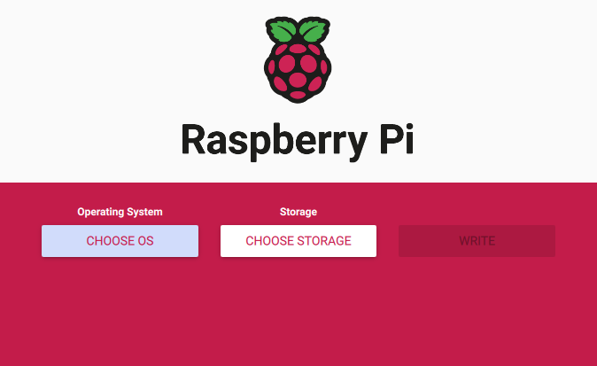

# Prius Camping

This repository contains the source code and documentation regarding my 2014 Toyota Prius camping setup. Diagnostics and vehicle sensor data provided by the ECUs are read over USB OBD-II serial cable (`ISO 9141`) to a Raspberry Pi API service & dashboard.

See helpful tips and recommended items in my [Prius Camping & Survival Overview](./docs/README.md).

Please join our 𝕏 [Prius Camping Community](https://x.com/i/communities/1760105186679570893)!


### Table of Contents

- [Features](#features)
- [Result](#result)
- [Install](#install)
- **[>> Development Roadmap](./docs/development.md)**
- [Special Thanks](#special-thanks)

----

## [#](#features) Features

See the [services layout](./docs/services.md) for more details.
You may also want to see the [hardware involved](./docs/prius_camping.md#hardware).

- [x] pfSense Gateway:
  - [x] Captive Portal.
  - [x] DNS Resolver.
  - [x] DHCP Server.
  - [x] Dual-WAN fail-over.
- [x] Raspberry Pi 4 (model B) Raspbian (Debian) Linux Computer.
  - [ ] API Service.
  - [ ] WebSocket Gateway.
  - [ ] MariaDB Database.
  - [ ] Dashboard Web Server:
    - [ ] Firefox in Kiosk mode.
    - [ ] Onscreen JS keyboard.
    - [x] 10.1" LCD DSI Touch Display.
  - [ ] LAN Web Server:
    - [ ] Intra-network web chat.
    - [ ] Nostalgic web-based games.
- [ ] Starlink:
  - [x] Total bypass of Starlink Router via PoE injector.
  - [ ] gRPC endpoint metrics.
  - [ ] IPv4 GCNAT + IPv6 port forward (NAT64?).
- [ ] WiFi:
  - [x] Vonets WAN IN (STATION mode).
    - [x] Pre-configured list of networks to automatically join.
  - [x] Vonets LAN OUT (AP mode).
- [x] 2kW 120v AC Inverter.


## [#](#result) Result

**TBA:** These are some images of the project.


## [#](#install) Install

### 1. Setup

It is expected that you have a fresh clean install of the latest version of Rasbian Lite before continuing.

It is also expected you have a secure SSH key generated to access your RPi.

```sh
# Generate a new SSH key (Dolores is my car's name)
ssh-keygen -t rsa -b 4096 -P "" -f ~/.ssh/dolores

# View the public key to add in a later step
cat ~/.ssh/dolores.pub

# Add the newly generated SSH key to your keyring
ssh-add ~/.ssh/dolores
```

#### Using Raspberry Pi Imager

I recommend using the Raspberry Pi Imager for burning a fresh Rasbian install on a micro-SD card.




Select the gear in the bottom right corner to open the "Advanced options" menu.

Ensure the following settings are set with your desired username, a strong user password, and network settings if you are using WiFi.


### 2. Configuration

Copy the `example-config.sh` file to `config.sh` and configure it accordingly.


### 3. Run Installer

Now run `./deploy.sh install <host>` to install the project on to the host.


## [#](#special-thanks) Special Thanks

- My friends: Kyle, Harsh, Wade, Ashley, Khushi, Marcus
- Nikki Delventhal
- Levi & Leah
- Black Jimmy Neutron
- Joe Robinet
- J's Camp
- [OpenStreetMap](https://www.openstreetmap.org/)
- [Leaflet](https://leafletjs.com/)
