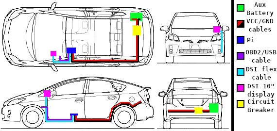

# Prius Camping Services

My Prius Camping setup is split up between a few devices, each with their own set of services.

- pfSense
  - Captive Portal
  - DNS Resolver
  - DHCP Server
  - WAN fail-over
    - Starlink
    - WiFi
- Raspberry Pi
  - API Service
  - WebSocket Gateway
  - Dashboard Web Server
  - LAN Site Web Server

If you haven't already, please see the [hardware involved](./prius_camping.md#hardware) in this project.

## [#](#components) Components

- prius-camping (this repo) - Configurations & Documentation
  - Captive Portal Pages
  - pfSense Configuration
  - RaspberryPi FS Overlays and Configurations
- [prius-camping-api](https://github.com/anthonywww/prius-camping-api) - Main API Service
  - `https://dolores.anthonyw.me/api`
- [prius-camping-gateway](https://github.com/anthonywww/prius-camping-gateway) - Live Events WebSocket Server Gateway
  - `https://dolores.anthonyw.me/gateway`
- [prius-camping-dash](https://github.com/anthonywww/prius-camping-dash) - Web Dashboard
  - `https://dolores.anthonyw.me/dashboard`
- [prius-camping-site](https://github.com/anthonywww/prius-camping-site) - LAN Site & Post Captive Portal Landing Page
  - `https://dolores.anthonyw.me/`
  - `https://dns-test.dolores.anthonyw.me/`

## [#](#wiring-diagram) Wiring Diagram

This is a basic electrical wiring diagram of my Prius Camping setup.

